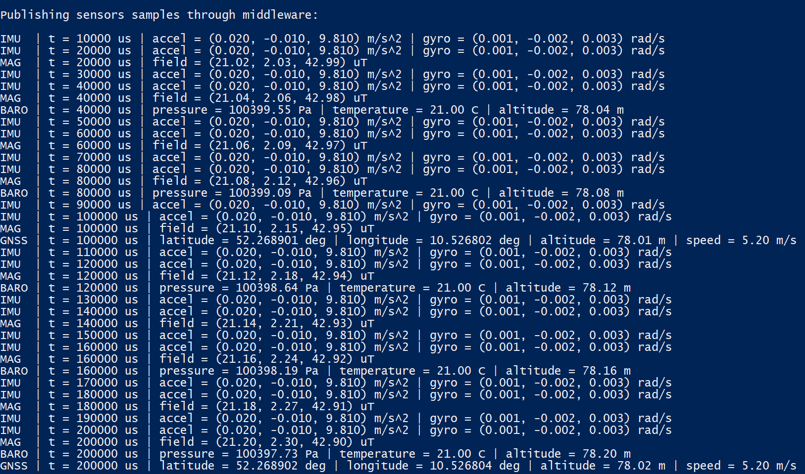
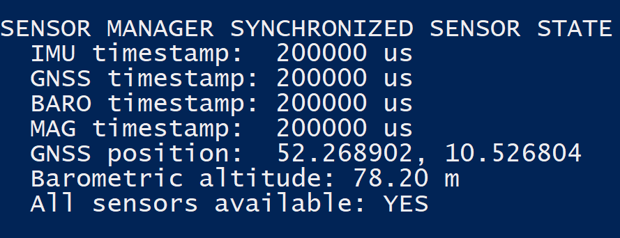

# Embedded Avionics Sensor Platform

A portable C++ avionics software platform demonstrating sensor-driver abstraction, publish-subscribe middleware, sensor health monitoring, time synchronization, fault injection, and software-in-the-loop (SIL) validation.

The project is designed as a portable, hardware-independent embedded avionics software stack. The architecture is intentionally structured to enable future integration with PX4, uORB, and NuttX.

## Project Objectives

- Develop modular drivers for IMU, GNSS, barometer, and magnetometer sensors.
- Decouple flight applications from hardware-specific sensor implementations.
- Implement lightweight publish-subscribe middleware.
- Detect stale, invalid, and unavailable sensor measurements.
- Generate time-aligned sensor data for flight-control and navigation modules.
- Validate nominal and fault scenarios through automated tests.
- Provide a migration path to PX4/uORB and NuttX.

## Current Development Phase

The project currently implements a portable software-in-the-loop (SIL)
embedded avionics software stack in modern C++17.

Completed components include:

- Modular simulated sensor drivers
- Publish–Subscribe middleware
- Multi-sensor synchronization through a Sensor Manager
- Hardware-independent software architecture
- CMake build system
- Windows SIL validation

The next development phase will introduce:

- Sensor Health Monitoring
- Platform abstraction (STM32, Linux, QNX)
- PX4/uORB adapters
- NuttX validation on Ubuntu
- Real GNSS hardware integration

---

## Implemented Sensors

- ✅ IMU (100 Hz)
- ✅ Magnetometer (50 Hz)
- ✅ Barometer (25 Hz)
- ✅ GNSS (10 Hz)

Future:

- ⬜ Air-data sensor

---

## System Architecture

```mermaid
flowchart TB

subgraph Sensors
IMU
GNSS
Barometer
Magnetometer
end

subgraph Drivers
SensorDrivers
end

subgraph Middleware
MessageBus
SensorManager
end

subgraph Services
HealthMonitor
TimeSynchronization
end

subgraph FlightSoftware
Navigation
FlightController
Telemetry
end

Sensors --> SensorDrivers
SensorDrivers --> MessageBus
MessageBus --> SensorManager

SensorManager --> HealthMonitor
SensorManager --> TimeSynchronization

HealthMonitor --> Navigation
TimeSynchronization --> Navigation

Navigation --> FlightController
FlightController --> Telemetry

````
## Current Progress

### Simulated IMU Driver

The first sensor driver has been implemented using a hardware-independent driver interface. The simulation currently produces deterministic IMU data at 100 Hz to support software-in-the-loop (SIL) development.

<p align="center">

</p>

---

### Publish–Subscribe Middleware

The embedded middleware implements a lightweight publish–subscribe architecture that decouples sensor drivers from higher-level avionics applications. Each sensor publishes timestamped measurements at its own sampling frequency, allowing multiple independent subscribers such as the Sensor Manager, telemetry modules, logging, and future navigation algorithms.

Implemented publishing rates:

IMU — 100 Hz
Magnetometer — 50 Hz
Barometer — 25 Hz
GNSS — 10 Hz


<p align="center"> 

</p>

---

### Sensor Manager

The Sensor Manager subscribes to all middleware topics and maintains the latest valid measurement from each sensor. It provides a synchronized system-wide sensor state that can later be consumed by navigation, flight-control, and health-monitoring modules.

Current responsibilities include:

- Latest valid sample management
- Multi-sensor synchronization
- Timestamp consistency
- Centralized sensor access
- Hardware-independent interface

Future extensions:

- Sensor health monitoring
- Stale-data detection
- Timestamp validation
- Fault injection
- Navigation interface

<p align="center"> 
 
</p>

---

## Project Status

### Completed

- ✅ Modular C++17 project architecture
- ✅ CMake build system
- ✅ Hardware-independent sensor interfaces
- ✅ Simulated IMU Driver (100 Hz)
- ✅ Simulated Magnetometer Driver (50 Hz)
- ✅ Simulated Barometer Driver (25 Hz)
- ✅ Simulated GNSS Driver (10 Hz)
- ✅ Publish–Subscribe Middleware
- ✅ Multi-sensor Sensor Manager
- ✅ Software-in-the-loop (SIL) validation

### In Progress

- Sensor Health Monitoring
- Platform Abstraction Layer

### Planned

- ⬜ STM32 HAL platform
- ⬜ Linux/POSIX platform
- ⬜ QNX platform
- ⬜ PX4/uORB adapter
- ⬜ NuttX integration
- ⬜ Real GNSS hardware driver
- ⬜ Air-data sensor

---


## Technologies

- C++17
- CMake
- Publish–Subscribe Middleware
- Software-in-the-loop (SIL)
- Modular Sensor Drivers
- Git
- GitHub Actions (planned)
- PX4/uORB (planned)
- NuttX (planned)
- STM32 HAL (planned)
- Linux/POSIX (planned)
- QNX (planned)

---

## 👤 Author

**Vasan Iyer**  
GNC / Embedded Systems Engineer  

Focus areas:
 
- Embedded systems (C++, Python) 
- GNC
- Flight dynamics & control  
- Sensor fusion & state estimation  
- Autonomous systems  
- UAV systems 


GitHub: https://github.com/Vaiy108