# Autonomous UAV Avionics & Flight-Control Stack

A C++17 autonomous UAV flight-control software stack demonstrating
cascaded position, attitude and altitude control, actuator allocation,
nonlinear 6-DOF rigid-body simulation, and PX4/Gazebo software-in-the-loop (SITL)
validation.

The project extends an embedded avionics architecture with a complete
closed-loop multirotor control path:

**Position Command → Position Controller → Attitude Controller →
Motor Mixer → Actuator Model → 6-DOF Vehicle Dynamics → State Feedback**

The implementation is designed as a modular software-in-the-loop
development and validation environment for small autonomous UAS.

---

## Key Capabilities

- Embedded-oriented C++17 flight-control implementation
- Cascaded XY position, attitude and altitude control
- PID control with output limiting and integral protection
- X-configuration quadrotor motor mixing
- Motor/actuator thrust and torque modelling
- Nonlinear 6-DOF rigid-body vehicle dynamics
- Quaternion-based attitude propagation
- Translational and rotational dynamic coupling
- Closed-loop mission simulation
- Quantitative flight-performance analysis
- Unit and integration testing
- PX4 SITL / Gazebo validation environment

---

## 6-DOF Closed-Loop Flight-Control Validation

The cascaded controller was evaluated using a nonlinear 6-DOF
quadrotor model.

### Validation Mission

Initial vehicle state:

- Position: `(0, 0, 1 m)`
- Level attitude
- Zero translational velocity

Commanded position:

- X: `5 m`
- Y: `3 m`
- Altitude: `1 m`

The outer position controller generates roll and pitch commands,
which are tracked by the inner attitude controller. The altitude
controller independently regulates collective thrust.

### Results

| Metric | Result |
|---|---:|
| Position target | 5.0 m X / 3.0 m Y |
| Final position | 5.020 m X / 3.032 m Y |
| Final horizontal position error | **0.038 m** |
| X overshoot | **11.74%** |
| Y overshoot | **12.96%** |
| X settling time (2%) | **8.36 s** |
| Y settling time (2%) | **8.75 s** |
| Final altitude | **1.00045 m** |
| Minimum altitude | **0.969 m** |
| Maximum altitude | **1.007 m** |
| Maximum attitude excursion | ~**13.5°** |
| Motor saturation | **None** |

The vehicle converges to the commanded horizontal position while
maintaining approximately 1 m altitude and returning to near-level
attitude at the target.

---

### Position Tracking
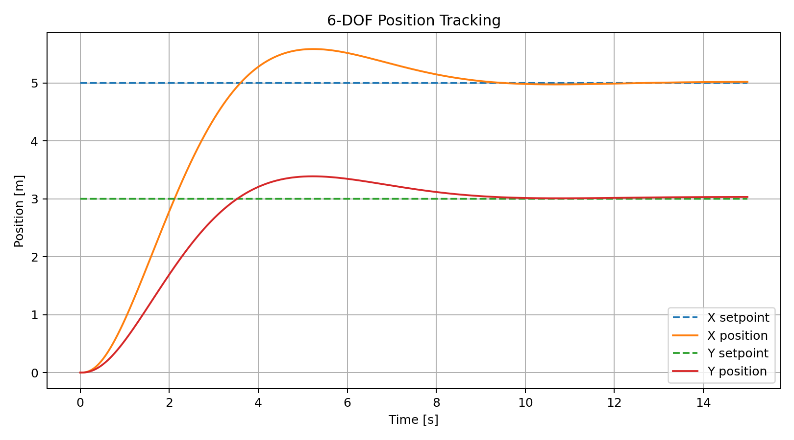

### XY Flight Trajectory
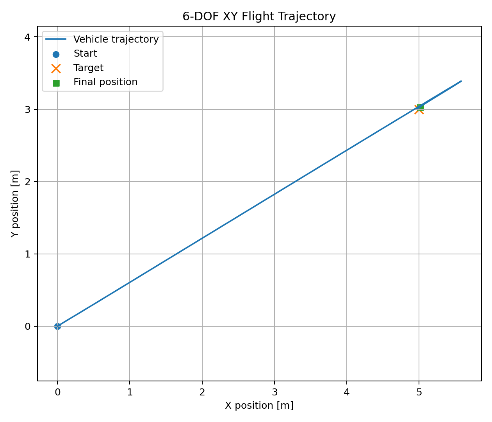

### Attitude Tracking
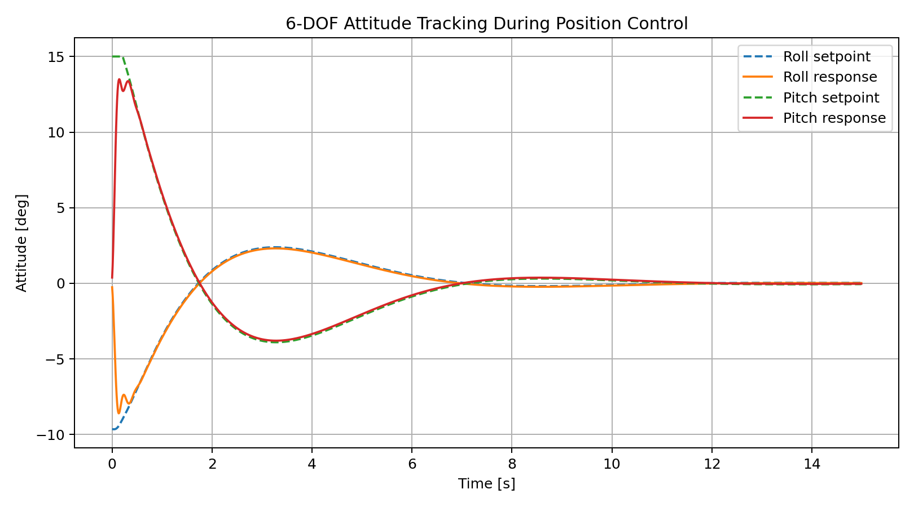

### Altitude Hold
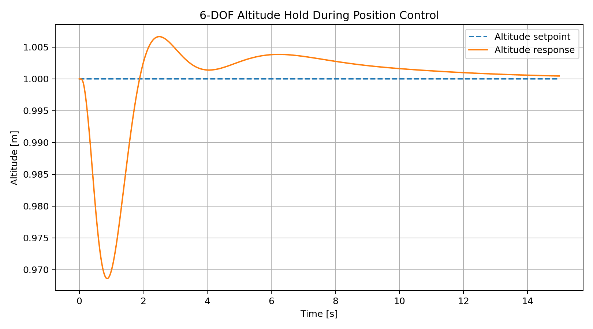

---

---

## PX4 SITL / Gazebo Autonomous Flight Validation

The flight-control work was extended to an industry-standard PX4
software-in-the-loop (SITL) environment using Gazebo and QGroundControl.

A simulated PX4 x500 quadrotor was used to execute an autonomous
waypoint mission while vehicle state, estimator outputs, navigation
status, and actuator commands were inspected through PX4 uORB topics.
The resulting PX4 ULog was then processed offline to quantitatively
evaluate closed-loop flight performance.

### Validation Architecture

The PX4 validation path is:

**QGroundControl Mission → PX4 Navigation → Position / Attitude Control →
Control Allocation → Gazebo Vehicle Dynamics → Simulated Sensors →
EKF2 State Estimation → uORB State Feedback**

This complements the custom C++ 6-DOF simulation by validating autonomous
flight behavior using the PX4 autopilot software stack and a physics-based
simulation environment.

### Autonomous Mission

The mission was created in QGroundControl and consisted of:

- autonomous takeoff
- waypoint navigation
- altitude-controlled flight
- multi-waypoint trajectory execution
- Return-to-Launch (RTL)
- autonomous descent and landing

The vehicle initially climbed to approximately **5 m** for waypoint
navigation. During the return sequence, PX4 commanded the configured RTL
altitude before descending back to the launch position.

### Mission Plan

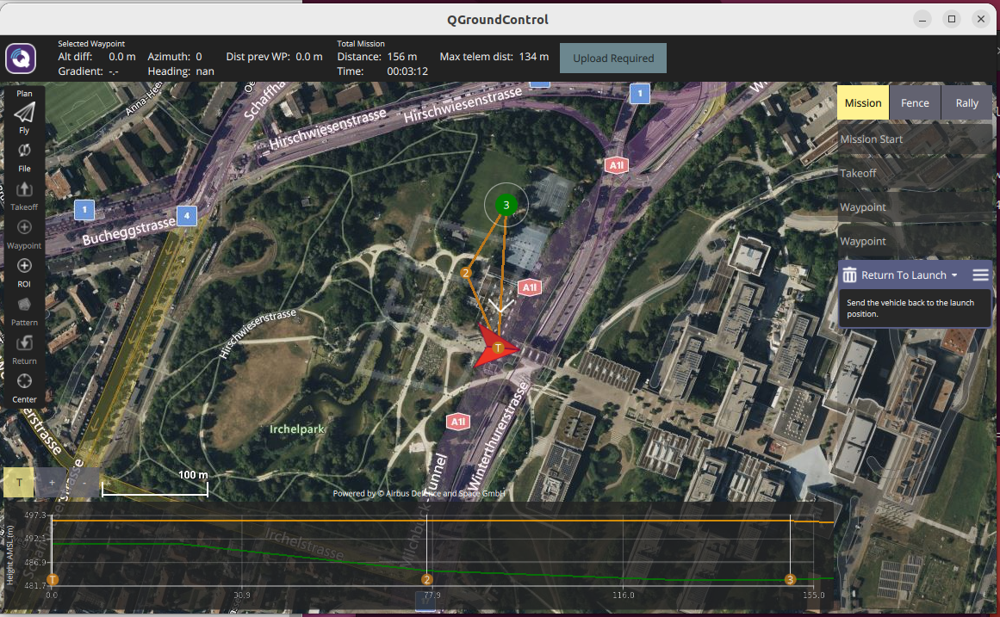

### Autonomous Mission Execution

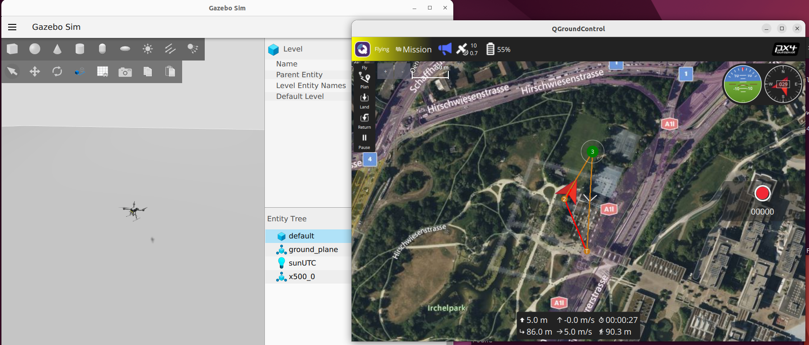

The mission was executed using the PX4 x500 multicopter model in Gazebo,
with QGroundControl providing mission planning and vehicle monitoring.

---

### uORB Runtime Inspection

PX4's uORB middleware was inspected during SITL operation to verify the
flow of navigation, state-estimation, vehicle-status, and actuator data.

The following topics were examined:

- `vehicle_local_position` — EKF local position and velocity estimate
- `vehicle_gps_position` — simulated GNSS position and velocity
- `vehicle_status` — arming and navigation state
- `vehicle_attitude` — estimated vehicle orientation
- `actuator_motors` — normalized motor commands

#### Local Position

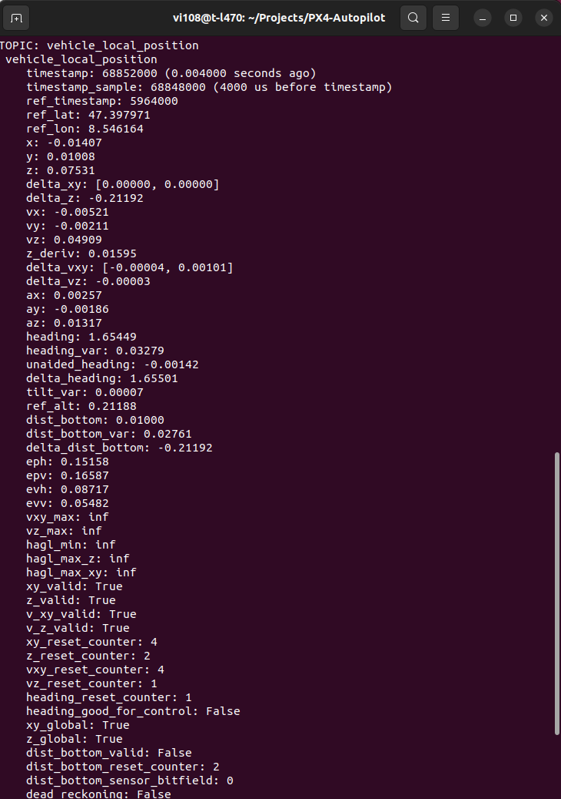

#### GNSS Position

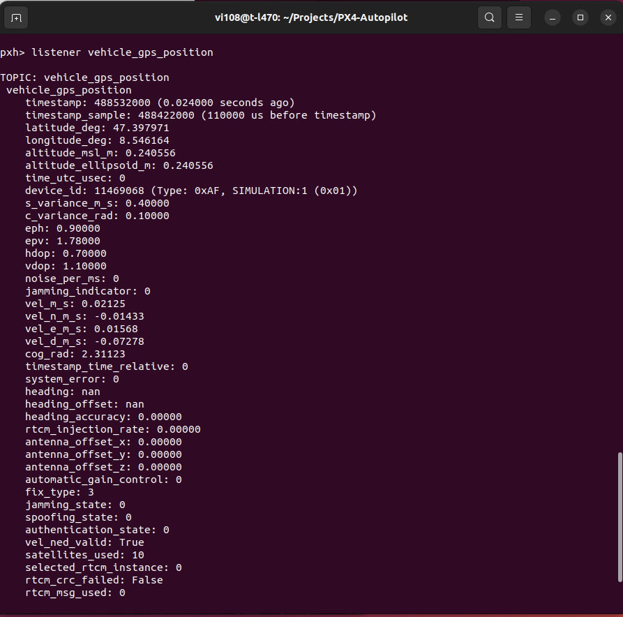

#### Vehicle Status

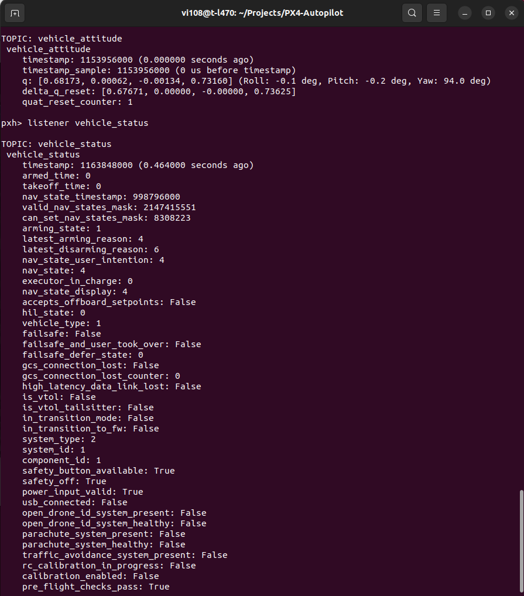

#### Motor Commands During Flight

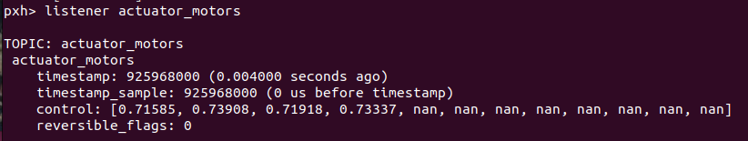

The in-flight actuator inspection confirms that individual motor commands
are actively modulated by the PX4 control and allocation pipeline during
waypoint tracking.

---

## PX4 ULog Flight-Performance Analysis

The PX4 ULog generated during the autonomous mission was parsed using
`pyulog`. Commanded setpoints were compared against estimated vehicle
states over the detected flight interval.

### Quantitative Results

| Metric | Result |
|---|---:|
| Autonomous flight duration | **104.56 s** |
| Maximum horizontal displacement | ~**134 m** |
| Maximum altitude | ~**30 m** |
| Horizontal position RMSE | **0.139 m** |
| Vertical position RMSE | **0.044 m** |
| Roll tracking RMSE | **1.323°** |
| Pitch tracking RMSE | **1.080°** |
| Maximum motor command | **0.889** |
| Motor saturation samples | **0** |

The results show close agreement between commanded and estimated vehicle
states throughout the autonomous mission. Position and altitude tracking
remain accurate through waypoint navigation and RTL, while the attitude
controller follows roll and pitch commands generated during trajectory
changes.

No motor saturation was observed during the analyzed flight.

### Local Position Tracking

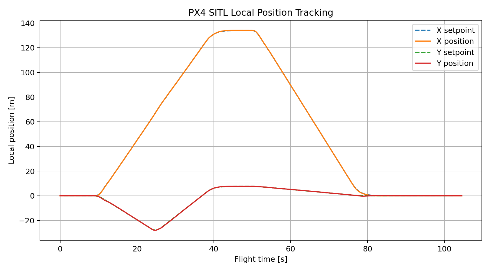

The measured local X/Y trajectory closely follows the PX4 position
setpoints through outbound waypoint navigation and the return trajectory.

### Altitude Tracking

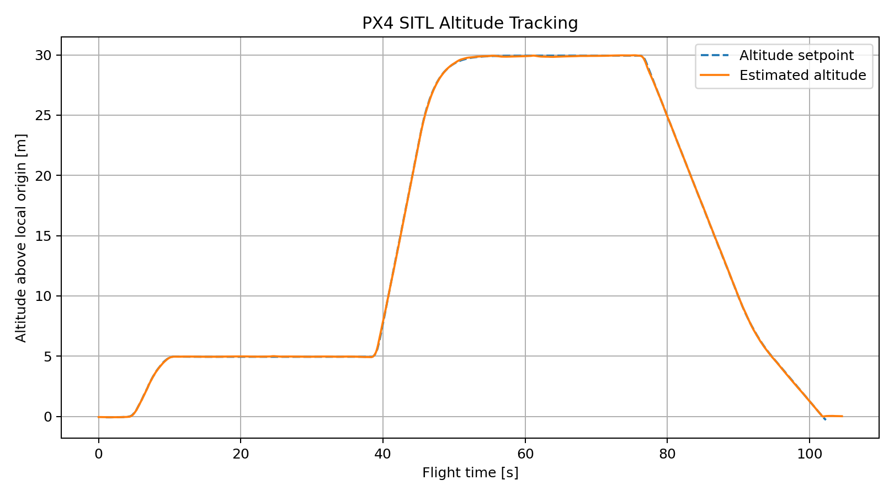

The altitude response captures the initial waypoint-flight altitude,
the higher PX4 RTL altitude, and the final autonomous descent.

### Attitude Tracking

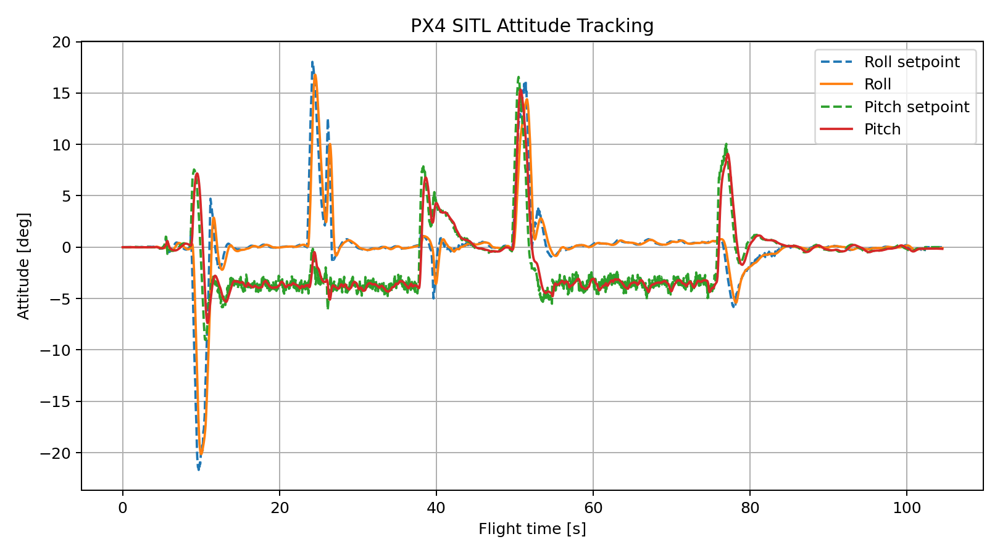

Measured roll and pitch closely follow their respective attitude
setpoints during acceleration, waypoint transitions, and RTL.

### Motor Commands

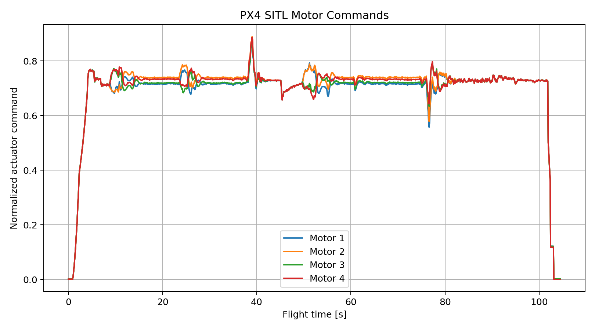

The four motor commands show differential control activity during
maneuvers while remaining below saturation throughout the mission.

---

### PX4 Validation Summary

The PX4 SITL campaign demonstrates the complete autonomous-flight
validation workflow:

**Mission Planning → Autonomous Execution → State Estimation →
Flight Control → Actuator Allocation → Physics Simulation →
Flight Logging → Post-Flight Performance Analysis**

Together with the custom nonlinear 6-DOF simulation, this provides two
complementary validation layers:

1. **Custom C++ flight-control simulation** for controller implementation,
   vehicle dynamics, actuator modelling, and algorithm-level analysis.
2. **PX4 SITL / Gazebo validation** for autopilot integration, autonomous
   mission execution, uORB inspection, and flight-log-based system
   validation.
   
   

