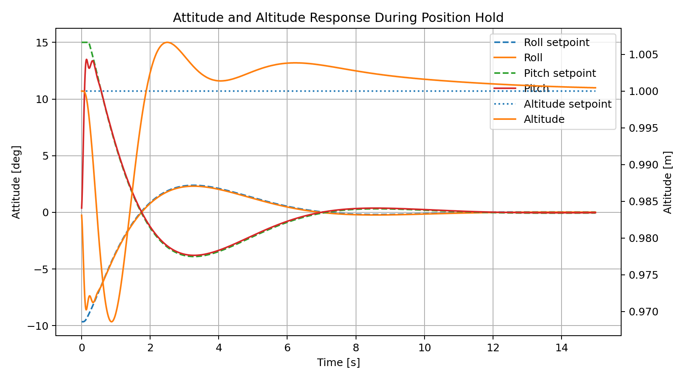

# Autonomous UAV Avionics & Flight-Control Stack

A C++17 autonomous UAV flight-control software stack demonstrating
cascaded position, attitude and altitude control, actuator allocation,
nonlinear 6-DOF rigid-body simulation, and software-in-the-loop
validation.

The project extends an embedded avionics architecture with a complete
closed-loop multirotor control path:

**Position Command → Position Controller → Attitude Controller →
Motor Mixer → Actuator Model → 6-DOF Vehicle Dynamics → State Feedback**

The implementation is designed as a modular software-in-the-loop
development and validation environment for small autonomous UAS.

---

## Key Capabilities

- Embedded-oriented C++17 flight-control implementation
- Cascaded XY position, attitude and altitude control
- PID control with output limiting and integral protection
- X-configuration quadrotor motor mixing
- Motor/actuator thrust and torque modelling
- Nonlinear 6-DOF rigid-body vehicle dynamics
- Quaternion-based attitude propagation
- Translational and rotational dynamic coupling
- Closed-loop mission simulation
- Quantitative flight-performance analysis
- Unit and integration testing
- PX4 SITL / Gazebo validation environment

---

## 6-DOF Closed-Loop Flight-Control Validation

The cascaded controller was evaluated using a nonlinear 6-DOF
quadrotor model.

### Validation Mission

Initial vehicle state:

- Position: `(0, 0, 1 m)`
- Level attitude
- Zero translational velocity

Commanded position:

- X: `5 m`
- Y: `3 m`
- Altitude: `1 m`

The outer position controller generates roll and pitch commands,
which are tracked by the inner attitude controller. The altitude
controller independently regulates collective thrust.

### Results

| Metric | Result |
|---|---:|
| Position target | 5.0 m X / 3.0 m Y |
| Final position | 5.020 m X / 3.032 m Y |
| Final horizontal position error | **0.038 m** |
| X overshoot | **11.74%** |
| Y overshoot | **12.96%** |
| X settling time (2%) | **8.36 s** |
| Y settling time (2%) | **8.75 s** |
| Final altitude | **1.00045 m** |
| Minimum altitude | **0.969 m** |
| Maximum altitude | **1.007 m** |
| Maximum attitude excursion | ~**13.5°** |
| Motor saturation | **None** |

The vehicle converges to the commanded horizontal position while
maintaining approximately 1 m altitude and returning to near-level
attitude at the target.

---

### Position Tracking

### XY Flight Trajectory

### Attitude and Altitude Response

