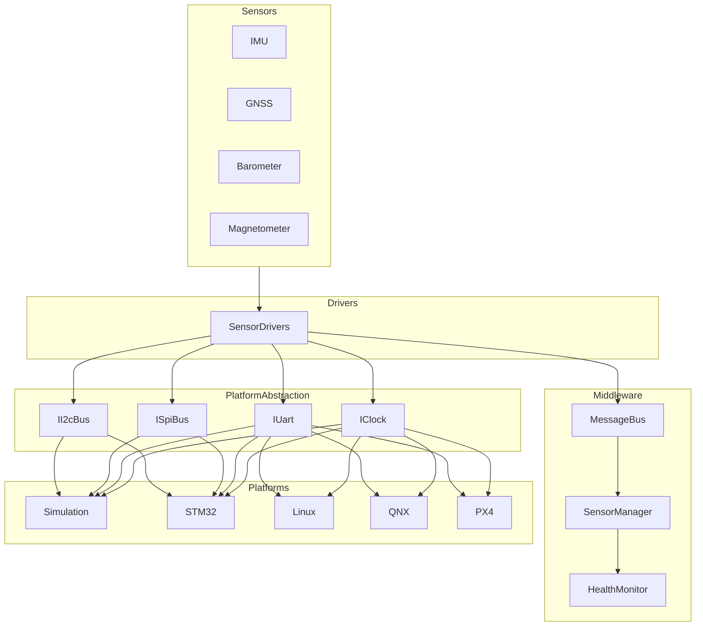
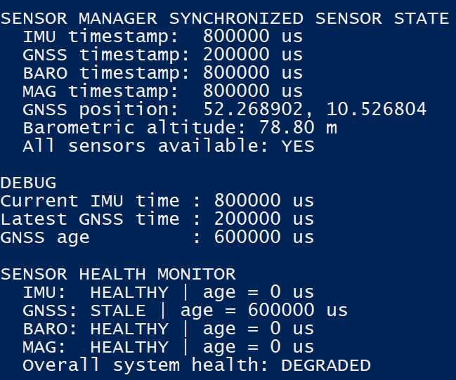
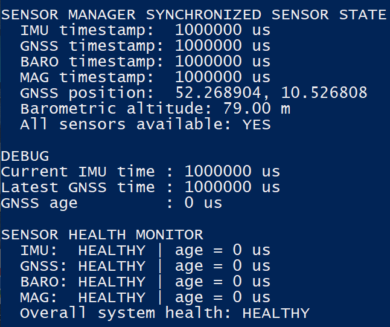

# Embedded Avionics Sensor Platform

## Overview

This project implements a modular **Embedded Avionics Software Stack** in modern **C++17**, following the layered architecture commonly used in aerospace and autonomous flight systems. The project emphasizes modular avionics software architecture, multi-rate sensor acquisition, centralized sensor management, and fault detection using software-in-the-loop (SIL) simulation.

The project demonstrates the complete embedded software pipeline from low-level sensor drivers to middleware, centralized sensor management, health monitoring, and portable platform abstraction.

Current implementation includes:

- Modular simulated sensor drivers
- Publish–Subscribe middleware
- Multi-sensor synchronization
- Sensor Health Monitoring
- Fault Injection & Automatic Recovery
- Platform Abstraction Layer
- Software-in-the-loop (SIL) validation

The architecture is designed to be portable across simulation, STM32, Linux, QNX, and PX4/NuttX platforms without changing the driver logic.


## Project Objectives

- Develop modular drivers for IMU, GNSS, barometer, and magnetometer sensors.
- Decouple flight applications from hardware-specific sensor implementations.
- Implement lightweight publish-subscribe middleware.
- Detect stale, invalid, and unavailable sensor measurements.
- Generate time-aligned sensor data for flight-control and navigation modules.
- Validate nominal and fault scenarios through automated tests.
- Provide a migration path to PX4/uORB and NuttX.

## Current Development Phase

The project currently implements a portable software-in-the-loop (SIL)
embedded avionics software stack in modern C++17.

Completed components include:

- Modular simulated sensor drivers
- Publish–Subscribe middleware
- Multi-sensor synchronization through a Sensor Manager
- Hardware-independent software architecture
- CMake build system
- Windows SIL validation

The next development phase will introduce:

- Sensor Health Monitoring
- Platform abstraction (STM32, Linux, QNX)
- PX4/uORB adapters
- NuttX validation on Ubuntu
- Real GNSS hardware integration

---

## Implemented Sensors

- ✅ IMU (100 Hz)
- ✅ Magnetometer (50 Hz)
- ✅ Barometer (25 Hz)
- ✅ GNSS (10 Hz)

Future:

- ⬜ Air-data sensor

---

## System Architecture



## Current Progress

### Simulated IMU Driver

The first sensor driver has been implemented using a hardware-independent driver interface. The simulation currently produces deterministic IMU data at 100 Hz to support software-in-the-loop (SIL) development.

<p align="center">

</p>

---

### Publish–Subscribe Middleware

The embedded middleware implements a lightweight publish–subscribe architecture that decouples sensor drivers from higher-level avionics applications. Each sensor publishes timestamped measurements at its own sampling frequency, allowing multiple independent subscribers such as the Sensor Manager, telemetry modules, logging, and future navigation algorithms.

Implemented publishing rates:

IMU — 100 Hz
Magnetometer — 50 Hz
Barometer — 25 Hz
GNSS — 10 Hz


<p align="center"> 

</p>

---

### Sensor Manager

The Sensor Manager subscribes to all middleware topics and maintains the latest valid measurement from each sensor. It provides a synchronized system-wide sensor state that can later be consumed by navigation, flight-control, and health-monitoring modules.

Current responsibilities include:

- Latest valid sample management
- Multi-sensor synchronization
- Timestamp consistency
- Centralized sensor access
- Hardware-independent interface

Future extensions:

- Sensor health monitoring
- Stale-data detection
- Timestamp validation
- Fault injection
- Navigation interface

<p align="center"> 
 
</p>

---

## Sensor Health Monitoring

The Sensor Health Monitor continuously evaluates the operational state of each sensor using timestamp-based freshness monitoring.

Current capabilities:

- Latest sample validation
- Timestamp consistency checks
- Stale sensor detection
- Overall system health evaluation
- Automatic recovery after communication restoration

Each sensor is classified as:

- **HEALTHY**
- **STALE**
- **UNAVAILABLE**

A GNSS communication dropout is intentionally injected into the software-in-the-loop simulation.

The Health Monitor detects stale sensor data, transitions the system state to **DEGRADED**, and automatically restores the system to **HEALTHY** once valid GNSS data resumes.

### Fault Detection

<p align="center">

</p>

### Automatic Recovery

<p align="center">

</p>


This demonstrates the complete fault lifecycle:

```
Normal Operation
        ↓
GNSS Communication Dropout
        ↓
STALE Sensor Detection
        ↓
Overall System DEGRADED
        ↓
GNSS Recovery
        ↓
Automatic System Recovery
```

---

## Platform Abstraction Layer

The project introduces a hardware-independent platform abstraction layer that isolates embedded sensor drivers from operating system and hardware-specific implementations.

Current interfaces:

| Interface | Purpose |
|-----------|----------|
| **IClock** | Common timestamp source |
| **IUart** | UART communication |
| **ISpiBus** | SPI communication |
| **II2cBus** | I²C communication |

Current simulation implementations:

- SimulationClock
- SimulatedUart
- SimulatedSpiBus
- SimulatedI2cBus

Future implementations:

- STM32 HAL
- Linux/POSIX
- QNX
- PX4/NuttX

Using dependency injection, sensor drivers depend only on abstract interfaces rather than platform-specific APIs.

Consequently, migrating the software to another operating system or hardware platform requires only a new platform implementation while the driver logic remains unchanged.

--- 

## Project Status

### Completed

- ✅ Modular C++17 architecture
- ✅ CMake build system
- ✅ Simulated IMU Driver
- ✅ Simulated GNSS Driver
- ✅ Simulated Barometer Driver
- ✅ Simulated Magnetometer Driver
- ✅ Publish–Subscribe Middleware
- ✅ Multi-Sensor Manager
- ✅ Sensor Health Monitor
- ✅ Fault Injection & Recovery
- ✅ Platform Abstraction Layer
- ✅ Shared Clock Infrastructure
- ✅ Software-in-the-loop Validation

### In Progress

- Linux/POSIX implementation
- STM32 HAL implementation
- PX4 integration

### Planned

- ⬜ NuttX support
- ⬜ Real GNSS (NEO-M8N)
- ⬜ PX4 uORB adapter
- ⬜ Embedded debugging examples


---


## Technologies

- Modern C++17
- CMake
- Publish–Subscribe Middleware
- Software-in-the-loop (SIL)
- Modular Sensor Drivers
- Platform Abstraction Layer
- Dependency Injection
- Git
- GitHub

Planned:

- STM32 HAL
- Linux/POSIX
- PX4
- NuttX

---

## Folder Structure

```
embedded-avionics-software-stack/

├── include/
│   └── avionics/
│       ├── drivers/
│       ├── middleware/
│       ├── messages/
│       ├── services/
│       └── platform/
│           ├── interfaces/
│           │   ├── IClock.hpp
│           │   ├── IUart.hpp
│           │   ├── ISpiBus.hpp
│           │   └── II2cBus.hpp
│           │
│           └── simulation/
│               ├── SimulationClock.hpp
│               ├── SimulatedUart.hpp
│               ├── SimulatedSpiBus.hpp
│               └── SimulatedI2cBus.hpp
│
├── src/
│   ├── drivers/
│   ├── middleware/
│   ├── services/
│   └── platform/
│       ├── simulation/
│       ├── stm32/
│       ├── linux/
│       ├── qnx/
│       └── px4/

```

## Roadmap

### Completed

- Sensor Drivers
- Middleware
- Sensor Manager
- Health Monitoring
- Fault Injection
- Platform Abstraction

### Next

- Linux Validation
- STM32 HAL Backend
- PX4 Integration
- NuttX Build
- Real GNSS Driver

---

## 👤 Author

**Vasan Iyer**  
GNC / Embedded Systems Engineer  

Focus areas:
 
- Embedded systems (C++, Python) 
- GNC
- Flight dynamics & control  
- Sensor fusion & state estimation  
- Autonomous systems  
- UAV systems 


GitHub: https://github.com/Vaiy108